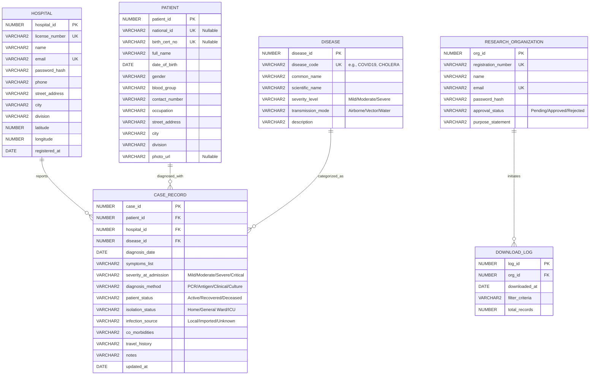

# Database Course Project Proposal: PublicHealthMap

---

## 1. Project Overview

### 1.1 Project Title
**PublicHealthMap**: A Decentralized Disease Surveillance & Spatial Epidemic Mapping System

### 1.2 Abstract
In public health, timely and accurate data collection on disease outbreaks is critical for containment and response. **PublicHealthMap** is a database-driven web application designed to track and visualize the spread of critical and infectious diseases. 

Authorized hospitals and medical centers can securely register and log clinical case records, detailing patient information, symptoms, severity, and diagnostic details. These records are consolidated into a central Oracle Database. 

The public, other medical institutions, and policy-makers can access interactive dashboards showing real-time geographical disease distribution (map views, graphs, and statistics). Registered research organizations can apply to download anonymized patient-disease datasets for epidemiology studies. Security is enforced through rigorous role-based access control (RBAC) and PL/SQL-driven data anonymization to protect patient privacy (HIPAA-compliant principles).

### 1.3 Project Objectives
- Provide a standardized portal for healthcare facilities to report critical disease cases.
- Offer dynamic public dashboards for tracking epidemic outbreaks and transmission rates across geographic regions.
- Facilitate clinical research by providing secure, anonymized data downloads for researchers.
- Enforce strict database-level security, data integrity, and transactional reliability.

---

## 2. Features and Core Modules

The application is structured into four main modules:

### 2.1 Hospital & Medical Center Portal
- **Secure Authentication**: Credentials verified using database-level validation or app-level verification.
- **Batch Patient Entry**: Medical staff can log in once and input multiple patient case records in a single session.
- **Patient Lookup**: Authorized hospitals can query historical patient case records using the patient's unique National ID (NID) or Birth Certificate Number (BCN) for continuity of care.

### 2.2 Disease Tracking & Case Reporting (Clinical-grade Info)
A highly detailed, professional clinical data structure:
- **Patient Demographics**: Name, NID/BCN, Date of Birth, Gender, Occupation (for tracking occupational hazards, e.g., healthcare, farming), Contact Number, and Address.
- **Disease Profiling**: Standardized disease directory (e.g., COVID-19, Tuberculosis, Cholera, Dengue) containing severity classifications and transmission vectors.
- **Case Diagnosis Details**: Diagnosis Date, symptoms, severity level, diagnostic methods (PCR, Antigen, Clinical, Culture), patient isolation status, patient outcome, and travel history.

### 2.3 Visitor Dashboard & Public Visualization
- **Spatial Map View**: Visual representation of active outbreaks grouped by administrative divisions/cities.
- **Outbreak Charts**: Graphs (bar, line, pie) tracking trends over time, mortality rates, and recovery statistics.
- **Search and Filters**: Filter data by disease type, time period, region, and severity.

### 2.4 Researcher Portal & Secure Export
- **Organization Registration**: Research centers submit registration numbers and credentials.
- **Data Export Pipeline**: Approved organizations can download patient datasets filtered by criteria.
- **Database-Level Data Masking**: A PL/SQL export routine strips patient names, contact numbers, NID/BCN, and specific house numbers, replacing them with a secure hash (`PATIENT_HASH`) and aggregating spatial coordinates to division/city levels.

---

## 3. Technology Stack

The project leverages a modern web architecture combined with a robust database system:

| Layer | Technology | Purpose |
| :--- | :--- | :--- |
| **Frontend** | React (Vite) | Single Page Application (SPA), state management, responsive UI components. |
| **Styling** | Vanilla CSS / Tailwind CSS | Customized dark-mode glassmorphic theme with visual harmony. |
| **Maps & Charts** | Leaflet.js & Chart.js / Recharts | Map visualization of disease spread and interactive statistics. |
| **Backend API** | Node.js (Express) | RESTful API routing, JWT-based authentication, and communication with the DB. |
| **Database** | Oracle Database XE / Cloud | Relational data store, relational algebra constraints, PL/SQL logic. |
| **DB Connectivity** | `oracledb` (Node.js driver) | Native Express-to-Oracle database connection pool management. |

---

## 4. Entity-Relationship (ER) Diagram

The diagram models the relationships between registered hospitals, patients, diseases, case reports, researchers, and data audits.



> [!NOTE]
> A visual image render of this ER diagram is generated and can be viewed here: [public_health_map_er_diagram.png](file:///C:/Users/Nihad/.gemini/antigravity-ide/brain/8c8c2027-548e-4c1a-ad7a-0e88428810de/public_health_map_er_diagram_1781404545697.png).

---

## 5. Normalized Relational Database Schema

All tables are designed to satisfy **Third Normal Form (3NF)** rules:
1. **1NF**: Every column contains atomic values, and there are no repeating groups.
2. **2NF**: All non-prime attributes are fully functionally dependent on the primary key (no partial dependencies).
3. **3NF**: There are no transitive dependencies (no non-prime attribute depends on another non-prime attribute).

> [!NOTE]
> A visual physical database schema diagram showing Oracle column types and foreign key line links is generated and can be viewed here: [database_schema_diagram.png](file:///C:/Users/Nihad/.gemini/antigravity-ide/brain/8c8c2027-548e-4c1a-ad7a-0e88428810de/database_schema_diagram_1781404666841.png).

### 5.1 Relational Tables (Oracle DDL-Ready Schema)

#### Table: `HOSPITALS`
Stores registration and geo-coordinates of reporting hospitals.
- **HOSPITAL_ID** (`NUMBER`, Primary Key)
- **LICENSE_NUMBER** (`VARCHAR2(50)`, Unique, Not Null)
- **NAME** (`VARCHAR2(150)`, Not Null)
- **EMAIL** (`VARCHAR2(100)`, Unique, Not Null)
- **PASSWORD_HASH** (`VARCHAR2(255)`, Not Null)
- **PHONE** (`VARCHAR2(20)`, Not Null)
- **STREET_ADDRESS** (`VARCHAR2(255)`)
- **CITY** (`VARCHAR2(100)`, Not Null)
- **DIVISION** (`VARCHAR2(100)`, Not Null)
- **LATITUDE** (`NUMBER(9,6)`, Not Null)
- **LONGITUDE** (`NUMBER(9,6)`, Not Null)
- **REGISTERED_AT** (`DATE`, Default `SYSDATE`)

#### Table: `PATIENTS`
Stores patient profiles. Medical data is linked from this table via relationships.
- **PATIENT_ID** (`NUMBER`, Primary Key)
- **NATIONAL_ID** (`VARCHAR2(30)`, Unique, Nullable)
- **BIRTH_CERT_NO** (`VARCHAR2(30)`, Unique, Nullable)
- **FULL_NAME** (`VARCHAR2(150)`, Not Null)
- **DATE_OF_BIRTH** (`DATE`, Not Null)
- **GENDER** (`VARCHAR2(10)`, Check: `IN ('Male', 'Female', 'Other')`)
- **BLOOD_GROUP** (`VARCHAR2(5)`, Check: `IN ('A+', 'A-', 'B+', 'B-', 'AB+', 'AB-', 'O+', 'O-')`)
- **CONTACT_NUMBER** (`VARCHAR2(20)`, Not Null)
- **OCCUPATION** (`VARCHAR2(100)`)
- **STREET_ADDRESS** (`VARCHAR2(255)`)
- **CITY** (`VARCHAR2(100)`, Not Null)
- **DIVISION** (`VARCHAR2(100)`, Not Null)
- **PHOTO_URL** (`VARCHAR2(500)`)
- **CONSTRAINT** `chk_patient_id` (Check: `NATIONAL_ID IS NOT NULL OR BIRTH_CERT_NO IS NOT NULL`)

#### Table: `DISEASES`
Stores a dictionary of cataloged critical diseases.
- **DISEASE_ID** (`NUMBER`, Primary Key)
- **DISEASE_CODE** (`VARCHAR2(20)`, Unique, Not Null, e.g., 'COVID19', 'TB')
- **COMMON_NAME** (`VARCHAR2(100)`, Not Null)
- **SCIENTIFIC_NAME** (`VARCHAR2(150)`)
- **SEVERITY_LEVEL** (`VARCHAR2(20)`, Check: `IN ('Mild', 'Moderate', 'Severe')`)
- **TRANSMISSION_MODE** (`VARCHAR2(50)`, Check: `IN ('Airborne', 'Waterborne', 'Vector', 'Contact', 'Zoonotic')`)
- **DESCRIPTION** (`VARCHAR2(1000)`)

#### Table: `CASE_RECORDS`
Connects patients, diseases, and reporting hospitals. Stems patient case profiles.
- **CASE_ID** (`NUMBER`, Primary Key)
- **PATIENT_ID** (`NUMBER`, Foreign Key references `PATIENTS(PATIENT_ID)`, Not Null)
- **HOSPITAL_ID** (`NUMBER`, Foreign Key references `HOSPITALS(HOSPITAL_ID)`, Not Null)
- **DISEASE_ID** (`NUMBER`, Foreign Key references `DISEASES(DISEASE_ID)`, Not Null)
- **DIAGNOSIS_DATE** (`DATE`, Not Null, Check: `DIAGNOSIS_DATE <= SYSDATE`)
- **SYMPTOMS_LIST** (`VARCHAR2(1000)`, Not Null)
- **SEVERITY_AT_ADMISSION** (`VARCHAR2(20)`, Check: `IN ('Mild', 'Moderate', 'Severe', 'Critical')`)
- **DIAGNOSIS_METHOD** (`VARCHAR2(50)`, Check: `IN ('PCR', 'Antigen', 'Clinical', 'Culture', 'Imaging')`)
- **PATIENT_STATUS** (`VARCHAR2(20)`, Check: `IN ('Active', 'Recovered', 'Deceased')`, Default 'Active')
- **ISOLATION_STATUS** (`VARCHAR2(30)`, Check: `IN ('Home Isolation', 'General Ward', 'ICU', 'CCU')`)
- **INFECTION_SOURCE** (`VARCHAR2(30)`, Check: `IN ('Local Transmission', 'Imported', 'Unknown')`)
- **CO_MORBIDITIES** (`VARCHAR2(500)`)
- **TRAVEL_HISTORY** (`VARCHAR2(500)`)
- **NOTES** (`VARCHAR2(1000)`)
- **UPDATED_AT** (`DATE`, Default `SYSDATE`)

#### Table: `RESEARCH_ORGANIZATIONS`
- **ORG_ID** (`NUMBER`, Primary Key)
- **REGISTRATION_NUMBER** (`VARCHAR2(100)`, Unique, Not Null)
- **NAME** (`VARCHAR2(150)`, Not Null)
- **EMAIL** (`VARCHAR2(100)`, Unique, Not Null)
- **PASSWORD_HASH** (`VARCHAR2(255)`, Not Null)
- **APPROVAL_STATUS** (`VARCHAR2(20)`, Check: `IN ('Pending', 'Approved', 'Rejected')`, Default 'Pending')
- **PURPOSE_STATEMENT** (`VARCHAR2(1000)`, Not Null)

#### Table: `DOWNLOAD_LOGS`
- **LOG_ID** (`NUMBER`, Primary Key)
- **ORG_ID** (`NUMBER`, Foreign Key references `RESEARCH_ORGANIZATIONS(ORG_ID)`, Not Null)
- **DOWNLOADED_AT** (`DATE`, Default `SYSDATE`)
- **FILTER_CRITERIA** (`VARCHAR2(500)`)
- **TOTAL_RECORDS** (`NUMBER`, Not Null)

---

## 6. PL/SQL and Database Design Integration

To fulfill the curriculum goals of an advanced Database & PL/SQL lab, the following systems are designed directly into the database engine:

### 6.1 Sequences and Autoincrement Triggers
Since Oracle pre-12c requires sequences for auto-increment, and database courses emphasize triggers, we define sequences and matching pre-insert triggers for primary keys:
```sql
CREATE SEQUENCE seq_case_id START WITH 1 INCREMENT BY 1;

CREATE OR REPLACE TRIGGER trg_case_id_auto
BEFORE INSERT ON CASE_RECORDS
FOR EACH ROW
WHEN (NEW.case_id IS NULL)
BEGIN
    SELECT seq_case_id.NEXTVAL INTO :NEW.case_id FROM dual;
END;
/
```

### 6.2 Data Validation & Anti-Duplicate Trigger (Compound Trigger)
To prevent duplicate case logs of active diseases for the same patient within a 30-day window, a trigger is necessary. However, querying the target table `CASE_RECORDS` within a row-level trigger causes an Oracle Mutating Table Error (ORA-04091). We resolve this using an advanced **Compound Trigger** that aggregates row changes and validates them at the statement level:
```sql
CREATE OR REPLACE TRIGGER trg_prevent_duplicate_case
FOR INSERT ON CASE_RECORDS
COMPOUND TRIGGER
    TYPE t_case_rec IS RECORD (
        patient_id      CASE_RECORDS.patient_id%TYPE,
        disease_id      CASE_RECORDS.disease_id%TYPE,
        diagnosis_date  CASE_RECORDS.diagnosis_date%TYPE
    );
    TYPE t_case_list IS TABLE OF t_case_rec;
    v_new_cases t_case_list := t_case_list();

    BEFORE EACH ROW IS
    BEGIN
        v_new_cases.EXTEND;
        v_new_cases(v_new_cases.LAST).patient_id     := :NEW.patient_id;
        v_new_cases(v_new_cases.LAST).disease_id     := :NEW.disease_id;
        v_new_cases(v_new_cases.LAST).diagnosis_date := :NEW.diagnosis_date;
    END BEFORE EACH ROW;

    AFTER STATEMENT IS
        v_count NUMBER;
    BEGIN
        FOR i IN 1..v_new_cases.COUNT LOOP
            SELECT COUNT(*)
            INTO v_count
            FROM CASE_RECORDS
            WHERE patient_id = v_new_cases(i).patient_id
              AND disease_id = v_new_cases(i).disease_id
              AND patient_status = 'Active'
              AND diagnosis_date BETWEEN (v_new_cases(i).diagnosis_date - 30) AND v_new_cases(i).diagnosis_date;
              
            IF v_count > 1 THEN
                RAISE_APPLICATION_ERROR(-20001, 'Data Entry Error: An active case of this disease is already logged for this patient within the past 30 days.');
            END IF;
        END LOOP;
    END AFTER STATEMENT;
END;
/
```

### 6.3 Secure Clinical Data Masking (PL/SQL Package)
To secure clinical records, researchers do not run `SELECT * FROM CASE_RECORDS`. Instead, they call a PL/SQL procedure inside a package that validates their permission and returns a cursor containing anonymized data (using SHA-256 for identity hashing and grouping granular address details at the city/division level):
```sql
CREATE OR REPLACE PACKAGE research_data_pkg AS
    TYPE ref_cursor IS REF CURSOR;
    
    PROCEDURE get_anonymized_cases(
        p_org_id       IN NUMBER,
        p_disease_code IN VARCHAR2,
        p_division     IN VARCHAR2,
        p_cursor       OUT ref_cursor
    );
END research_data_pkg;
/

CREATE OR REPLACE PACKAGE BODY research_data_pkg AS
    PROCEDURE get_anonymized_cases(
        p_org_id       IN NUMBER,
        p_disease_code IN VARCHAR2,
        p_division     IN VARCHAR2,
        p_cursor       OUT ref_cursor
    ) IS
        v_status VARCHAR2(20);
    BEGIN
        SELECT approval_status 
        INTO v_status 
        FROM RESEARCH_ORGANIZATIONS 
        WHERE org_id = p_org_id;
        
        IF v_status != 'Approved' THEN
            RAISE_APPLICATION_ERROR(-20002, 'Security Warning: Access Denied. Organization status is ' || v_status);
        END IF;

        OPEN p_cursor FOR
            SELECT 
                STANDARD_HASH(NVL(p.national_id, p.birth_cert_no), 'SHA256') AS patient_hash,
                p.gender,
                TRUNC(MONTHS_BETWEEN(c.diagnosis_date, p.date_of_birth)/12) AS age_at_diagnosis,
                p.occupation,
                p.city,
                p.division,
                d.disease_code,
                d.common_name,
                c.diagnosis_date,
                c.severity_at_admission,
                c.patient_status
            FROM CASE_RECORDS c
            JOIN PATIENTS p ON c.patient_id = p.patient_id
            JOIN DISEASES d ON c.disease_id = d.disease_id
            WHERE d.disease_code = NVL(p_disease_code, d.disease_code)
              AND p.division = NVL(p_division, p.division);
    END get_anonymized_cases;
END research_data_pkg;
/
```

### 6.4 Aggregating Disease Statistics using Cursors & DBMS_SCHEDULER
For fast performance on visitor maps and dashboards, aggregate queries should not scan millions of rows on every page reload. A PL/SQL stored procedure uses a **Cursor** to aggregate statistics into a summary cache table (`DIVISIONAL_STATS_SUMMARY`) nightly:
```sql
CREATE TABLE divisional_stats_summary (
    division VARCHAR2(100),
    disease_code VARCHAR2(20),
    active_cases NUMBER,
    total_cases NUMBER,
    total_deaths NUMBER,
    last_updated DATE
);

CREATE OR REPLACE PROCEDURE refresh_disease_stats IS
    CURSOR c_stats IS
        SELECT p.division, d.disease_code,
               SUM(CASE WHEN c.patient_status = 'Active' THEN 1 ELSE 0 END) as active,
               COUNT(c.case_id) as total,
               SUM(CASE WHEN c.patient_status = 'Deceased' THEN 1 ELSE 0 END) as deaths
        FROM CASE_RECORDS c
        JOIN PATIENTS p ON c.patient_id = p.patient_id
        JOIN DISEASES d ON c.disease_id = d.disease_id
        GROUP BY p.division, d.disease_code;
        
    v_div divisional_stats_summary.division%TYPE;
    v_code divisional_stats_summary.disease_code%TYPE;
    v_act NUMBER;
    v_tot NUMBER;
    v_dea NUMBER;
BEGIN
    -- Clear current cached stats
    EXECUTE IMMEDIATE 'TRUNCATE TABLE divisional_stats_summary';
    
    OPEN c_stats;
    LOOP
        FETCH c_stats INTO v_div, v_code, v_act, v_tot, v_dea;
        EXIT WHEN c_stats%NOTFOUND;
        
        INSERT INTO divisional_stats_summary (division, disease_code, active_cases, total_cases, total_deaths, last_updated)
        VALUES (v_div, v_code, v_act, v_tot, v_dea, SYSDATE);
    END LOOP;
    CLOSE c_stats;
    COMMIT;
END;
/
```

### 6.5 Indexing Strategy
To optimize query performance under high load, indexing is implemented on search boundaries:
- **B-Tree indexes** on search columns:
  - `CREATE INDEX idx_patients_nid ON PATIENTS(national_id);`
  - `CREATE INDEX idx_patients_bcn ON PATIENTS(birth_cert_no);`
- **Composite Indexes** to accelerate geographic aggregate queries:
  - `CREATE INDEX idx_cases_location ON CASE_RECORDS(disease_id, diagnosis_date);`

### 6.6 Concurrency and Transactions
- **Isolation Level**: Set to **Read Committed** (default Oracle isolation level) to allow concurrent case logging from multiple hospitals while maintaining consistent visual map representations.
- **Lock Management**: Oracle's row-level locking (TX locks) automatically handles concurrent edits of individual patient profiles without blocking registrations at other hospital sites.
- **Transaction Safe Operations**: Safe rollbacks using sub-transactions/savepoints during batch case entries. If a batch of 10 cases has 1 erroneous duplicate patient entry, the app rolls back to the savepoint of that specific entry while committing the valid 9 cases, reducing system friction.

---

## 7. Next Steps & Lab Deliverables
1. **DML and DDL Scripts**: Generate comprehensive SQL files containing table creations, triggers, and packages.
2. **Mock Data Seeding**: Create scripts inserting 50+ case records representing divisions across the country (e.g., Dhaka, Chittagong, Sylhet) to display dynamic trends.
3. **Application Development**:
   - Backend APIs inside Express (`/api/cases`, `/api/stats`, `/api/auth/hospital`).
   - Frontend dashboards showing analytical figures.
4. **Lab Report Appendix**: Document screenshots of working dashboards, database response tables, and PL/SQL console execution logs.
